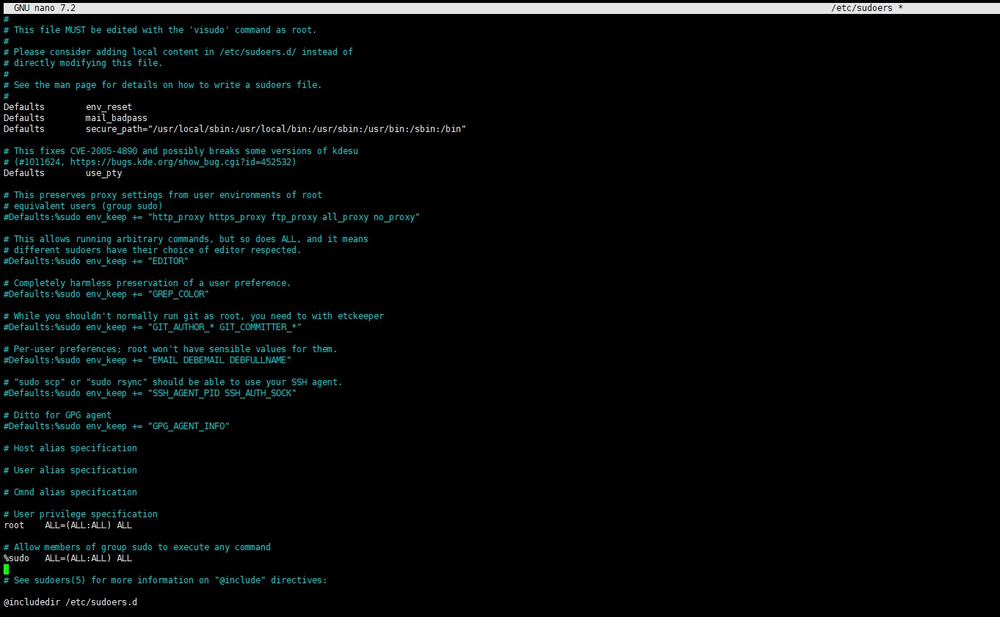

# kubernetes-guide #

## Scope of application ##

Mostly this guidance is for the user who **don't have any experience** in kubernetes deployment on debian(linux) system 
## Environment ## 

Debian 12.4 (up-to-date to latest at 2023/12/20)
containerd
Kubernetes v1.29.0 (up-to-date at 2023/12/21)

## Content ##

If you are a experienced linux user , can skip to step .

### Background ###

There is one thing have to discuss with, In Debian 12.4 the text editor -- nano is easy to use for the **beginners**.(Just a recommend)
It is also allowed to use other text editor like -- vi/vim.

### Step 1 obtain the sys access authority ###

After start the Debian System you will see the image as below.

#### Alternative ####
    su -
The system will ask you for the root password.

##### For Learning Environment #####

Skip to next step

##### For Poduction Environment  #####

    nano /etc/sudoers

Locate at the line as below:

    # Allow members of group sudo to execute any command
	%sudo   ALL=(ALL:ALL) ALL

Then add your system account below to obtain the system access authority.
(**This is based on your production environment system-access structure**. )

Here offers the full-access to the example account.

	dawnliving ALL=(ALL:ALL) ALL

(For the `nano` text editor press `Ctrl+O` and `Enter` to save the change to the file and press `Ctrl+X` to exit)

(For the `vi/vim` usually to press `:` ,  then input `wq` then press `Enter` to save and exit)

### Step 2 Edit the Package Repository ###

This step mainly talked about how to edit apt repository. There have a lot of ways to install required apps and kubernetes. But in this guidance, all the required apps and kubernetes(k8s) will be installed by **apt** package control tool(**Debian/Ubuntu**, in Centos uses yum).

	nano /etc/apt/source.list

Then visit the website(Here offer the official repository example)

[https://wiki.debian.org/SourcesList](https://wiki.debian.org/SourcesList)

In this website, need to find the example that official offers, then find the exact version of the operating system.
(This guide will choose Debian 12(Bookworm).)

The example as below:

	deb http://deb.debian.org/debian bookworm main contrib non-free-firmware
	deb-src http://deb.debian.org/debian bookworm main contrib non-free-firmware

	deb http://deb.debian.org/debian-security/ bookworm-security main contrib non-free-firmware
	deb-src http://deb.debian.org/debian-security/ bookworm-security main contrib non-free-firmware
	
	deb http://deb.debian.org/debian bookworm-updates main contrib non-free-firmware
	deb-src http://deb.debian.org/debian bookworm-updates main contrib non-free-firmware

Then paste one example(based on your requirement) to `source.list` save and exit.

### Step 3 Proxy Setting (If needed) ###

**Notice**: 

1. If your environment need to connect the Internet by Proxy. The guidance as below.
2. This step is **not necessary** for all users. If needed, continue reading. If not, skip to next step.

The root system access authority is needed. If the user log in is not root, the `sudo` is needed to attach to the front of all the following commands.

	systemctl set-environment http_proxy=your-example:port

	systemctl set-environment https_proxy=your-example:port

	systemctl set-environment no_proxy=localhost,127.0.0.0/8,192.168.0.0/16,10.0.0.0/8,172.16.0.0/12

Setting as above will let the system all the Internet connection through the proxy setting except the `no_proxy` declaration. If you don't want other service that don't mention in the guidance connect to the Internet through the proxy, modify the `no_proxy` setting, in case lead to other service connection refused error.

### Step 4 Container Runtimes Installation###

According to the most usage of container, This guide will choose the **containerd** as the Container Runtimes.

###If not root authority , all the command need to add **sudo**(including the pipe operator).###

1. Set up Docker's apt repository.

    #Add Docker's official GPG key:
    
    apt-get update
    
    apt-get install ca-certificates curl gnupg
    
    install -m 0755 -d /etc/apt/keyrings
    
    curl -fsSL https://download.docker.com/linux/debian/gpg | gpg --dearmor -o /etc/apt/keyrings/docker.gpg
    
    chmod a+r /etc/apt/keyrings/docker.gpg
    
    #Add the repository to Apt sources:
    
    echo \
    "deb [arch=$(dpkg --print-architecture) signed-by=/etc/apt/keyrings/docker.gpg] https://download.docker.com/linux/debian \
    $(. /etc/os-release && echo "$VERSION_CODENAME") stable" | \
    tee /etc/apt/sources.list.d/docker.list > /dev/null
    
    apt-get update

	    
Notice:

- **$VERSION_CODENAME** -- Here needed to replace by **bookworm**. (Based on the version of system.)
- `\` The operator is resembles with `\n` -- newline character. 

Will get such result as below.

2. Install the Docker packages.

	apt-get install docker-ce docker-ce-cli containerd.io docker-buildx-plugin docker-compose-plugin

3. Create a containerd configuration file.

    containerd config default | sudo tee /etc/containerd/config.toml

4. Configuring the systemd cgroup driver.

	nano /etc/containerd/config.toml

set like below:

	[plugins."io.containerd.grpc.v1.cri".containerd.runtimes.runc]
	  ...
	  [plugins."io.containerd.grpc.v1.cri".containerd.runtimes.runc.options]
	    SystemdCgroup = true

And:

	[plugins."io.containerd.grpc.v1.cri"]
	  sandbox_image = "registry.k8s.io/pause:3.2"

Then:

	systemctl restart containerd

### Step 5 Install kubeadm ###
To be continued